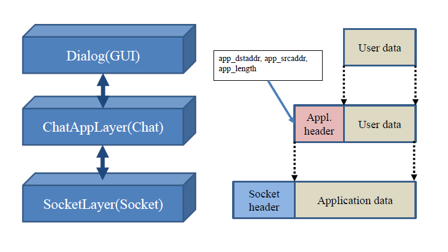
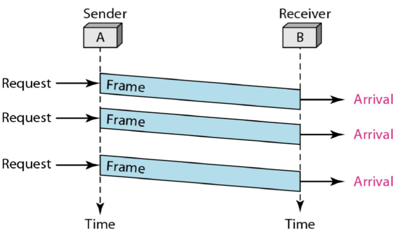
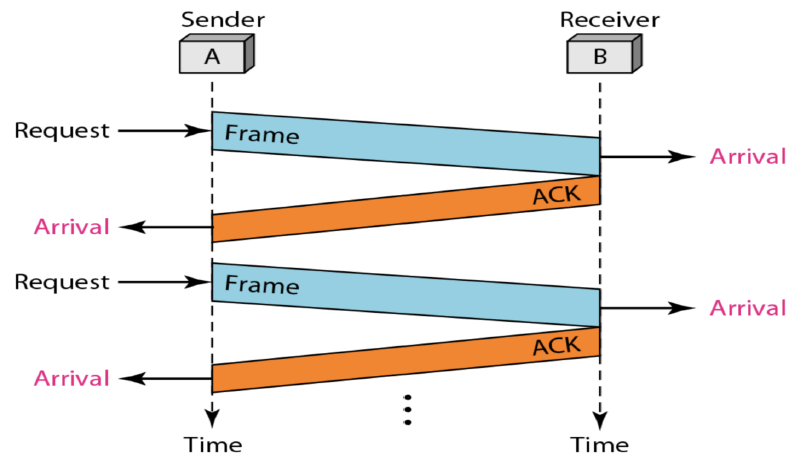
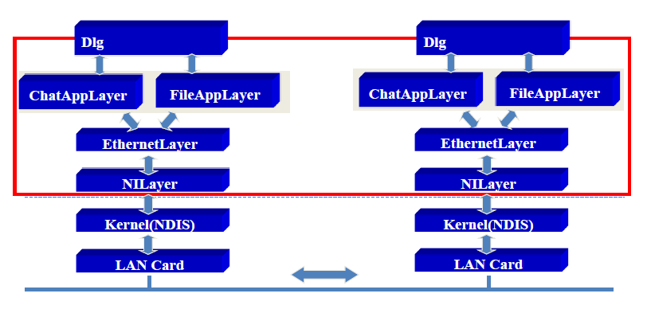

<!-- /**
 * @author [Limm-jk]
 * @email [201602057@cs-cnu.org]
 * @create date 2020-10-22 19:07:12
 * @modify date 2020-10-22 19:07:12
 * @desc [데이터통신 Readme 최신화]
 */ -->

# 2020_Spring_DataCommunication
- Network
  - 전송매체 링크로 서로 연결된 장치들의 모임
  - 서로 다른 장치들이 연결된 통신 그룹 단위
- Data Communicate  
  **정의**
  - 원거리에 있는 입출력 장치 및 컴퓨터들 간 통신 회선을 통해서, 문자, 숫자, 기호 등의로 표현된 데이터를 상호간 교환하는 통신  
  
  **목표**
  - 데이터 전송의 정확성
  - 데이터 전송의 안정성
  - 데이터 전송의 효율성  
  
  **구성요소**
  - 메시지, 송신자, 수신자, 전송매체, 프로토콜  

  **사용 환경**  
  - Windows OS  
  - WMware 15.5  
  - JDK 1.8  
  - JnetPcap 1.3  
  - WireShark 3.2.3  
  - WinPcap 4.1.3
### 1. IPC(Inter-Process Communication)
하나의 파일을 다중 프로세스들이 동시에 사용하고자 할 때 그 데이터를 필요로 하는 프로세스에게 전달이 제대로 안될 수 있음.  
이를 해결하기 위해 IPC 사용
> [IPC](https://github.com/Limm-jk/2020_Spring_DataCommunication/tree/master/IPC_JAVA/src/ipc) 

### 2. Simplest
**Data Link Layer(Ethernet)**
- 두 포인트(Point-to-Point)간 신뢰성 있는 전송을 보장하기 위한 계층
> [Simplest](https://github.com/Limm-jk/2020_Spring_DataCommunication/tree/master/Simplest/src)  

### 3. Stop & Wait
> [Stop & Wait](https://github.com/Limm-jk/2020_Spring_DataCommunication/tree/master/Stop%26Wait/stopwait)  

### 4. Chatting & File Transfer
FileAppLayer 추가구현. header를 통해 file과 chat 구분.
> [Chatting & File Transfer](https://github.com/Limm-jk/2020_Spring_DataCommunication/tree/master/Chatting_File_Transfer/src)  

